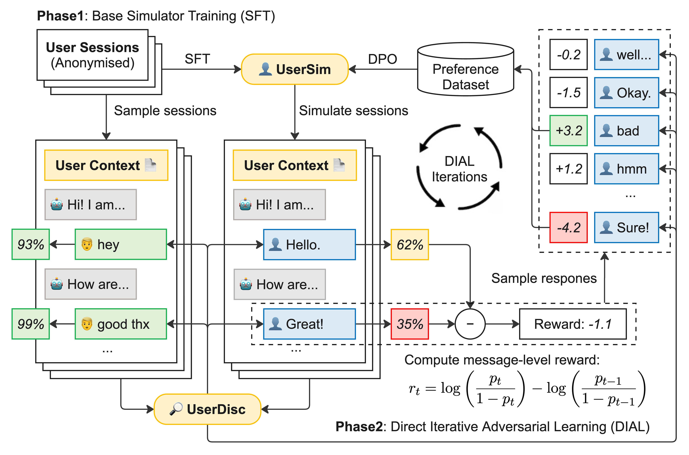

# DIAL: Direct Iterative Adversarial Learning for Realistic Multi-Turn Dialogue Simulation

Reference implementation of the paper:

> **DIAL: Direct Iterative Adversarial Learning for Realistic Multi-Turn Dialogue Simulation**
> Ziyi Zhu, Olivier Tieleman, Caitlin A. Stamatis, Luka Smyth, Thomas D. Hull, Daniel R. Cahn, Matteo Malgaroli.
> arXiv preprint [arXiv:2512.20773](https://arxiv.org/abs/2512.20773), 2025.

<p align="center">
  
</p>

---

## 🎯 Overview

DIAL (Direct Iterative Adversarial Learning) is a DPO-based adversarial training framework that produces realistic multi-turn user simulators by playing the simulator against a learned discriminator. Instead of optimising a fixed reward, DIAL alternates between scoring simulated user turns with a freshly trained discriminator and using those scores to construct **(chosen, rejected)** preference pairs for direct preference optimisation. Each round closes the gap between simulated and human dialogue distributions while keeping training stable and label-free.

This repository contains the public reproduction on **MultiWOZ 2.1** as a task-oriented benchmark, mirroring the procedure used in the paper for mental-health dialogue simulation.

## Latest News

- **2025 Dec**: DIAL paper released on arXiv ([2512.20773](https://arxiv.org/abs/2512.20773)) and code published.

### Key Features

- 🎭 **Two-Phase Pipeline**: Phase 1 (SFT) trains a base user simulator and response generator on anonymised dialogues; Phase 2 (DIAL) iteratively refines the simulator via adversarial preference learning.
- 🥊 **Learned Per-Turn Reward**: A token-classification discriminator on Llama-3.1-8B distinguishes real vs. simulated user turns and supplies a log-odds-delta reward at every utterance — no human labels required.
- 🔁 **Iterative DPO**: The lowest-reward turns are regenerated, re-scored, and turned into preference pairs that drive the next DPO round, producing successively more human-like simulators.
- 📊 **Faithful Evaluation Suite**: Plug-and-play comparison against rule-based, TUS, and GenTUS baselines, plus diversity metrics (TTR, Distinct-n, entropy) and **MAUVE** against the human MultiWOZ distribution.
- 💾 **Cache-Friendly**: Every long-running step writes per-dialogue artifacts under `cache/`, so reruns reuse prior simulations and only recompute what changed.

### How It Works

1. **Simulate** — the current user simulator (US) interacts with a response generator (RG) to produce dialogues.
2. **Discriminate** — a token-classification discriminator is trained to distinguish *real* (human) from *simulated* user turns at each end-of-turn token.
3. **Score** — the discriminator's log-odds-delta is used as a per-turn reward.
4. **Regenerate & rank** — the lowest-reward US turns are regenerated multiple times and ranked, producing `(chosen, rejected)` preference pairs.
5. **DPO** — the US is fine-tuned on those pairs and becomes the next iteration; loop back to step 1.

## 🚀 Quick Start

### Installation

```bash
# Clone DIAL alongside ConvLab-3 (used for MultiWOZ 2.1, baseline simulators, and the evaluator)
git clone <this-repo> dial
cd dial
git clone https://github.com/ConvLab/ConvLab-3.git
pip install -e ConvLab-3

# Python dependencies
pip install \
    torch transformers datasets peft \
    bitsandbytes accelerate \
    scikit-learn numpy tqdm wandb \
    together litellm openai \
    mauve-text
```

A modern GPU (≥ 24 GB VRAM, A100/H100 recommended) is required to train the 8B discriminator with 4-bit quantization and LoRA. SFT and DPO of the 70B simulator are launched on Together AI.

### API keys

The pipeline uses Together AI for SFT/DPO fine-tuning, OpenRouter or Together for inference, and OpenAI for MAUVE embeddings.

```bash
export TOGETHER_API_KEY=...
export OPENROUTER_API_KEY=...        # if using openrouter/* models
export OPENAI_API_KEY=...            # for compute_diversity.py (MAUVE)
export WANDB_API_KEY=...             # optional, enables W&B logging
export HF_TOKEN=...                  # to push generated datasets to the Hub
```

## 🔁 End-to-end Pipeline

DIAL alternates between (a) generating data with the current US/RG and (b) training the next US. Repeat steps 3–6 for each DIAL iteration (`it1`, `it2`, …); model and dataset names in the scripts include the iteration index.

### Step 1 — SFT datasets

Build SFT datasets for both the user simulator and the response generator from the MultiWOZ 2.1 train split, and push to the Hugging Face Hub.

```bash
python generate_sft_datasets.py
# Pushes:  slingshot/multiwoz-2.1-user-sim-sft
#          slingshot/multiwoz-2.1-response-gen-sft
```

Override the target repos with `HF_REPO_US` / `HF_REPO_RG`.

### Step 2 — SFT base US and RG

Fine-tune Llama-3.1-70B-Instruct on each SFT dataset via Together AI:

```bash
python launch_sft_us.py            # user simulator
python launch_sft_rg.py            # response generator
```

The resulting checkpoint IDs are used as the starting points for DIAL.

### Step 3 — Discriminator data

Pair real MultiWOZ validation dialogues with simulated dialogues produced by the current `LLM_US` × `LLM_RG`:

```bash
# Edit LLM_US_MODEL / LLM_RG_MODEL at the top of the file to point to the
# current iteration's checkpoints, then:
python generate_discriminator_data.py
# Pushes: slingshot/multiwoz-2.1-user-disc-dial-it{N}
```

Simulated dialogues are cached under `cache/discriminator/<us>__<rg>/`.

### Step 4 — Train the discriminator

Token-classification head on Llama-3.1-8B-Instruct, 4-bit + LoRA. Labels are placed at the EOT token of every assistant (US) message: `1=real`, `0=simulated`.

```bash
# Update HF_DATASET / RUN_NAME at the top of the file.
python train_discriminator.py
```

A checkpoint is written to `output/<RUN_NAME>/checkpoint-*`.

### Step 5 — Preference dataset

For each simulated dialogue, score every US turn with the discriminator, find the two lowest-reward turns, regenerate 8 alternatives at each via the current US model, re-score, and form `(chosen, rejected)` pairs using log-odds-delta as the reward signal.

```bash
# Update DISCRIMINATOR_CHECKPOINT, HF_DATASET, HF_OUTPUT_REPO, US_MODEL.
python generate_preference_dataset.py
# Pushes: slingshot/multiwoz-2.1-user-pref-dial-it{N}
```

Per-dialogue results are cached under `cache/preference/`.

### Step 6 — DPO

Launch DPO on Together AI starting from the previous iteration's US checkpoint:

```bash
python launch_dpo_us.py \
    --filter-chosen-rejected \
    --top-margin-frac 1.0 \
    --dpo-beta 1.0
```

The newly produced model becomes the US for iteration N+1; loop back to Step 3.

<details>
<summary>Click here to see common DPO arguments</summary>

| Argument                   | Description                                                                                  | Default |
| :------------------------- | :------------------------------------------------------------------------------------------- | :------ |
| `--filter-chosen-rejected` | Drop pairs where chosen and rejected are textually identical                                 | False   |
| `--top-margin-frac`        | Keep only the top-fraction of pairs by reward margin                                         | 1.0     |
| `--dpo-beta`               | DPO temperature β controlling KL divergence from the reference model                         | 1.0     |
| `--learning-rate`          | Peak learning rate for DPO                                                                   | 1e-6    |
| `--n-epochs`               | Number of DPO epochs over the preference dataset                                             | 1       |

</details>

## 📊 Evaluation

### Baselines

`run_baselines.py` evaluates standard US/system combinations on the MultiWOZ 2.1 test set:

| Combo               | User simulator | System                            |
| :------------------ | :------------- | :-------------------------------- |
| `rule_us_rule_sys`  | Rule           | Rule                              |
| `tus_rule_sys`      | TUS            | Rule                              |
| `gentus_rule_sys`   | GenTUS         | Rule                              |
| `llm_us_llm_rg`     | LLM US         | LLM RG                            |
| `llm_us_rule_sys`   | LLM US         | Rule pipeline NLU + Policy + NLG  |

```bash
python run_baselines.py
```

Per-dialogue traces are cached under `cache/baselines/<combo>/`. Aggregated results land in `experiment_results/<combo>/{results.json,summary.txt}`.

### DIAL-trained models

Run the same evaluation harness with iteration-specific US (and optionally a custom RG):

```bash
# Edit LLM_US_MODEL / LLM_RG_MODEL / COMBO_NAME at the top of the file.
python run_custom_models.py
```

### Diversity and distributional metrics

Compute TTR, Distinct-1/2/3, word entropy, mean utterance / conversation length, and **MAUVE** (with OpenAI embeddings) between simulated user utterances and the human distribution from MultiWOZ:

```bash
python compute_diversity.py
```

MAUVE results are cached under `.mauve_cache/<combo>_buckets_<N>.json`.

### Cleaning failed runs

If a baseline / discriminator / preference run errored mid-way, drop the empty entries before re-running:

```bash
python remove_empty_cache.py --dry-run    # preview
python remove_empty_cache.py              # delete
```

## 🗂 Repository Structure

```
.
├── ConvLab-3/                        # ConvLab-3 source tree (see Setup)
├── images/adversarial_training.jpg   # Framework diagram (above)
├── generate_sft_datasets.py          # Build US + RG SFT datasets from MultiWOZ 2.1
├── launch_sft_us.py                  # Launch SFT for the user simulator on Together AI
├── launch_sft_rg.py                  # Launch SFT for the response generator on Together AI
├── generate_discriminator_data.py    # Pair real and simulated dialogues for the discriminator
├── train_discriminator.py            # Train the token-classification discriminator (LoRA)
├── generate_preference_dataset.py    # Score, regenerate, and form (chosen, rejected) pairs
├── launch_dpo_us.py                  # Launch DPO fine-tuning of the US on Together AI
├── run_baselines.py                  # Evaluate baseline US/system combinations on the test set
├── run_custom_models.py              # Evaluate DIAL-trained US (+ RG) on the test set
├── compute_diversity.py              # Lexical diversity, distinct-n, entropy, MAUVE
└── remove_empty_cache.py             # Clean failed/empty cache entries between runs
```

## 💾 Caching

Every long-running step caches per-dialogue artifacts under `cache/`:

| Path                       | Producer                                   | Contents                                  |
| :------------------------- | :----------------------------------------- | :---------------------------------------- |
| `cache/baselines/<combo>/` | `run_baselines.py`, `run_custom_models.py` | Conversation + evaluator stats per dialog |
| `cache/discriminator/.../` | `generate_discriminator_data.py`           | Simulated US × RG conversations           |
| `cache/preference/.../`    | `generate_preference_dataset.py`           | Preference samples per dialogue           |
| `.mauve_cache/`            | `compute_diversity.py`                     | Cached MAUVE results per combo            |

Re-running a script reuses cached results; delete the relevant subdirectory to force regeneration.

## 📝 Notes

- All scripts default to model and dataset IDs under the `slingshot/` Hugging Face namespace. Update them (or override via the constants at the top of each file) when reproducing in your own workspace.
- `LLM_US` requires the model to emit a literal `[END]` token to terminate the dialogue. The data builders enforce this for ground-truth dialogues so that the SFT distribution matches inference.
- The paper's primary application is mental-health dialogue simulation; the code in this repository targets MultiWOZ 2.1 as a public, reproducible benchmark of the same DIAL procedure.

## 🤝 Contributing

Contributions are welcome! Please follow these steps:

1. Fork the repository
2. Create a feature branch (`git checkout -b feature/amazing-feature`)
3. Commit your changes (`git commit -m 'Add amazing feature'`)
4. Push to the branch (`git push origin feature/amazing-feature`)
5. Open a Pull Request

## 🙏 Acknowledgments

This work builds on [ConvLab-3](https://github.com/ConvLab/ConvLab-3) for MultiWOZ 2.1 loading, baseline user simulators (rule, TUS, GenTUS), the `LLM_US`/`LLM_RG` agent wrappers, and the MultiWOZ evaluator. SFT and DPO training are run on [Together AI](https://together.ai/), and MAUVE evaluation uses OpenAI embeddings via the [`mauve-text`](https://github.com/krishnap25/mauve) package.

## 📧 Contact

For questions and feedback:

- **Paper authors**: see the [arXiv paper](https://arxiv.org/abs/2512.20773) for author contact information.
- **Issues**: please open an issue on GitHub.

---

## 📝 Citation

If DIAL is useful in your research, please cite:

```bibtex
@article{zhu2025dial,
  title  = {DIAL: Direct Iterative Adversarial Learning for Realistic Multi-Turn Dialogue Simulation},
  author = {Zhu, Ziyi and Tieleman, Olivier and Stamatis, Caitlin A. and Smyth, Luka and Hull, Thomas D. and Cahn, Daniel R. and Malgaroli, Matteo},
  journal = {arXiv preprint arXiv:2512.20773},
  year   = {2025}
}
```

**⭐ Star us on GitHub if DIAL helps your research!**
